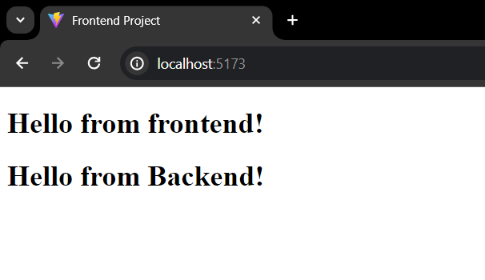

# Frontend - MERN Stack Template

## Description

This is the Frontend of the MERN Stack Template which is developed with react + vite. It runs on PORT 5173.

## Tech Stack

React.js + Vite, axios, jsdoc, better-docs

## How it looks



## Features

- Functions for fetching data using APIs from backend (src/lib)
- ESLint configure for preventing linting errors

## How to run the project

### Install dependencies

Use the following command to install all the dependencies.

```bash
npm install --legacy-peer-deps
```

### Setting up the project

1. Project information

To setup the project information, open `Frontend/package.json` file. Update the value of three keys in this file, that is, "name", "author" and "repository" as required.

2. Documentation information and configuration

The project has `Frontend/jsdoc.config.json` file which contains the configuration for using JSDoc for configuration. The documentation can be generated by using `npm run doc` command. Make sure comments are present in the code for generating documentation.

By default, it reads the comments from all the files, and directories under the directory `src/` recursively. If your code is stored in some other directory, you can change it by changing the value of source.inclue key of the config file.

Moreover, it generates the static website for documentation in a folder named 'documentation/' which is created under the root of the project. To change the name of the folder where static website is generated, change the value of opts.destination key from the config file.

Lastly, to setup the documentation information, update templates.better-docs.name, templates.better-docs.title and templates.better-docs.navLinks[0].href keys with the required value. To add to that, any other link can also be added on the navbar by adding items in the templates.better-docs.navLinks array.

### Available Scripts

Run development server.

```bash
npm run dev
```

Build the project.

```bash
npm run build
```

Run linting test on the code.

```bash
npm run lint
```

Generate static website for documentation using comments in the code.

```bash
npm run doc
```
